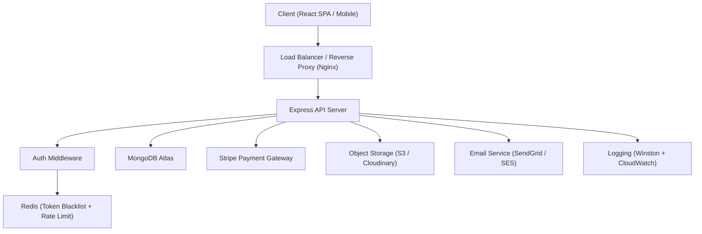
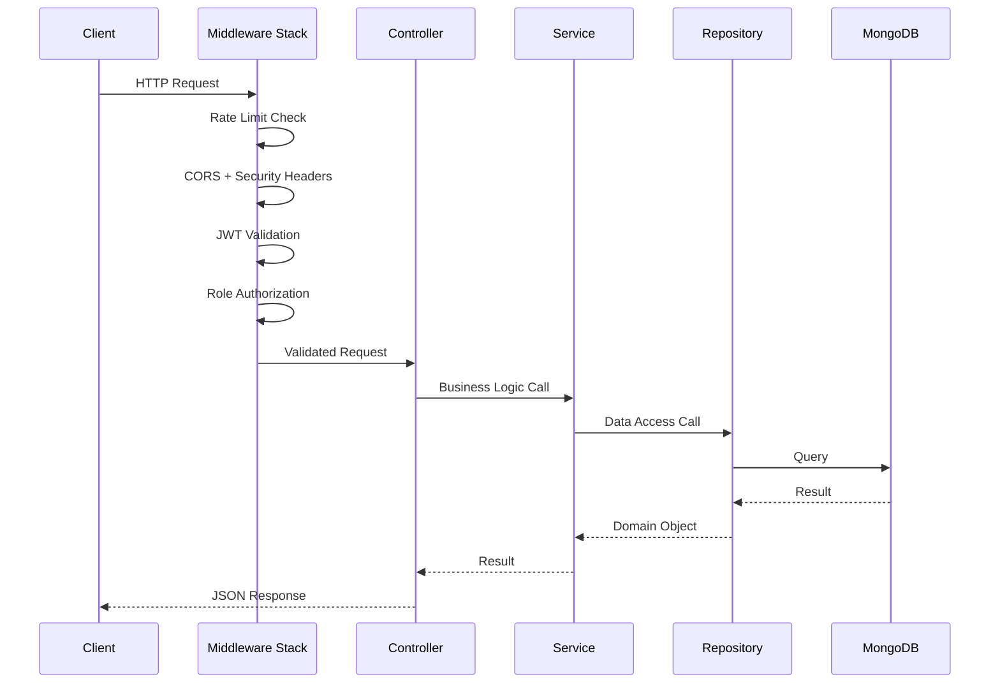
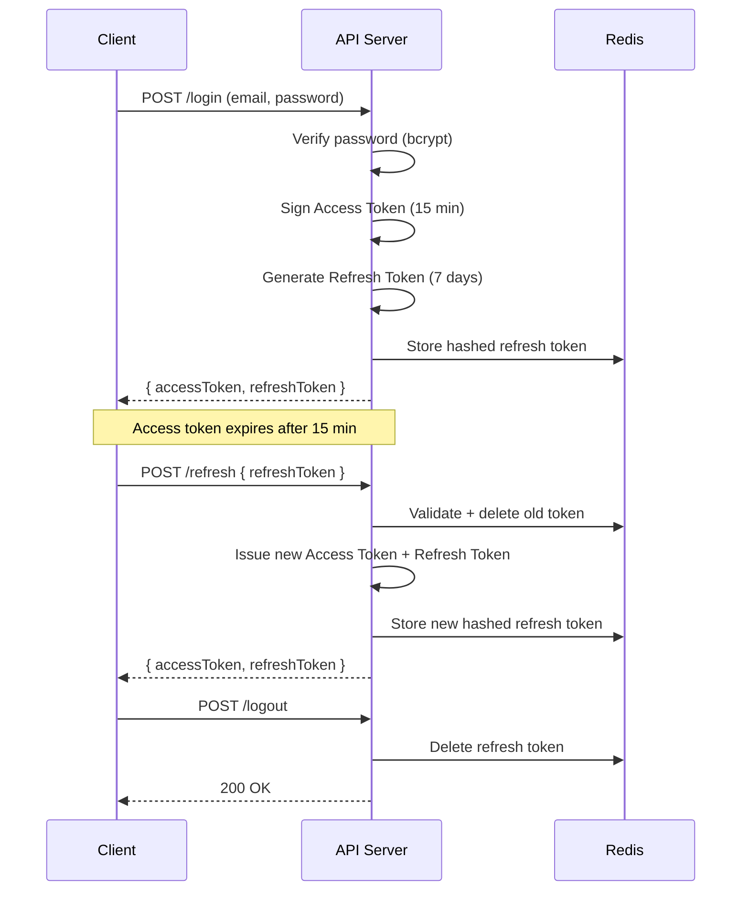

# Design Document: E-Commerce Platform

## Overview

The platform is a production-grade, RESTful e-commerce backend built with Node.js (Express), MongoDB (Mongoose), and a React frontend. It follows a layered architecture (Routes → Controllers → Services → Repositories → Database) with clear separation of concerns. Authentication is stateless JWT-based with Refresh Token rotation. Payments are delegated entirely to Stripe. The system is designed for horizontal scalability via stateless services and a document-oriented database.

---

## Architecture

### High-Level Architecture



### Request Lifecycle



---

## Components and Interfaces

### Backend Layer Structure

```
src/
├── config/           # Environment config, DB connection, constants
├── middleware/       # Auth, error handler, rate limiter, validator
├── modules/
│   ├── auth/         # Routes, controller, service, model
│   ├── users/
│   ├── products/
│   ├── categories/
│   ├── cart/
│   ├── orders/
│   ├── payments/
│   ├── reviews/
│   └── admin/
├── utils/            # JWT helpers, email sender, response formatter
├── types/            # Shared TypeScript interfaces
└── app.ts            # Express app bootstrap
```

### Frontend Layer Structure

```
client/
├── public/
├── src/
│   ├── api/          # Axios instances and API call functions
│   ├── components/   # Reusable UI components
│   ├── pages/        # Route-level page components
│   ├── store/        # Redux Toolkit slices (auth, cart, products)
│   ├── hooks/        # Custom React hooks
│   ├── utils/        # Formatters, validators
│   └── App.tsx
```

### Core Interfaces (TypeScript)

```typescript
interface IUser {
  _id: ObjectId;
  email: string;
  passwordHash: string;
  role: 'admin' | 'customer';
  isActive: boolean;
  createdAt: Date;
  updatedAt: Date;
}

interface IProduct {
  _id: ObjectId;
  name: string;
  description: string;
  price: number;
  stock: number;
  categoryId: ObjectId;
  images: string[];
  isDeleted: boolean;
  createdAt: Date;
  updatedAt: Date;
}

interface IOrder {
  _id: ObjectId;
  customerId: ObjectId;
  items: IOrderItem[];
  totalAmount: number;
  status: OrderStatus;
  paymentIntentId?: string;
  createdAt: Date;
  updatedAt: Date;
}

type OrderStatus = 'pending' | 'processing' | 'shipped' | 'delivered' | 'cancelled';

interface ICartItem {
  productId: ObjectId;
  quantity: number;
  priceAtAdd: number;
}
```

---

## Data Models

### MongoDB Schema Design

#### Users Collection

```javascript
{
  _id: ObjectId,
  email: { type: String, unique: true, lowercase: true, index: true },
  passwordHash: String,
  role: { type: String, enum: ['admin', 'customer'], default: 'customer' },
  isActive: { type: Boolean, default: true },
  refreshTokens: [{ token: String, expiresAt: Date }],  // stored hashed
  passwordResetToken: String,   // hashed
  passwordResetExpires: Date,
  createdAt: Date,
  updatedAt: Date
}
```

#### Products Collection

```javascript
{
  _id: ObjectId,
  name: { type: String, index: 'text' },
  description: { type: String, index: 'text' },
  price: { type: Number, min: 0 },
  stock: { type: Number, min: 0, default: 0 },
  categoryId: { type: ObjectId, ref: 'Category', index: true },
  images: [String],
  isDeleted: { type: Boolean, default: false, index: true },
  createdAt: Date,
  updatedAt: Date
}
// Compound index: { isDeleted: 1, categoryId: 1, price: 1 }
// Text index: { name: 'text', description: 'text' }
```

#### Categories Collection

```javascript
{
  _id: ObjectId,
  name: String,
  slug: { type: String, unique: true },
  parentId: { type: ObjectId, ref: 'Category', default: null },
  level: { type: Number, default: 0 },  // 0 = root, 1 = sub-category
  createdAt: Date
}
```

#### Carts Collection

```javascript
{
  _id: ObjectId,
  customerId: { type: ObjectId, ref: 'User', unique: true, index: true },
  items: [{
    productId: { type: ObjectId, ref: 'Product' },
    quantity: { type: Number, min: 1 },
    priceSnapshot: Number   // price at time of add
  }],
  updatedAt: Date
}
```

#### Orders Collection

```javascript
{
  _id: ObjectId,
  customerId: { type: ObjectId, ref: 'User', index: true },
  items: [{
    productId: ObjectId,
    name: String,          // snapshot at order time
    price: Number,         // snapshot at order time
    quantity: Number
  }],
  totalAmount: Number,
  status: {
    type: String,
    enum: ['pending', 'processing', 'shipped', 'delivered', 'cancelled'],
    default: 'pending',
    index: true
  },
  paymentIntentId: String,
  shippingAddress: {
    line1: String, city: String, state: String, postalCode: String, country: String
  },
  createdAt: Date,
  updatedAt: Date
}
```

#### Reviews Collection

```javascript
{
  _id: ObjectId,
  productId: { type: ObjectId, ref: 'Product', index: true },
  customerId: { type: ObjectId, ref: 'User' },
  rating: { type: Number, min: 1, max: 5 },
  comment: String,
  isDeleted: { type: Boolean, default: false },
  createdAt: Date
}
// Unique compound index: { productId: 1, customerId: 1 }
```

#### Payments Collection

```javascript
{
  _id: ObjectId,
  orderId: { type: ObjectId, ref: 'Order', index: true },
  customerId: ObjectId,
  stripePaymentIntentId: { type: String, unique: true },
  amount: Number,
  currency: { type: String, default: 'usd' },
  status: { type: String, enum: ['pending', 'succeeded', 'failed'] },
  stripeEventId: String,   // for idempotency
  createdAt: Date
}
```

### REST API Endpoints

#### Authentication — `/api/v1/auth`

| Method | Path | Auth | Description |
|--------|------|------|-------------|
| POST | /register | None | Register new customer |
| POST | /login | None | Login, returns JWT + refresh token |
| POST | /refresh | None | Exchange refresh token for new access token |
| POST | /logout | Customer | Invalidate refresh token |
| POST | /forgot-password | None | Send password reset email |
| POST | /reset-password/:token | None | Reset password with token |

#### Users — `/api/v1/users`

| Method | Path | Auth | Description |
|--------|------|------|-------------|
| GET | /me | Customer | Get own profile |
| PUT | /me | Customer | Update own profile |
| PUT | /me/password | Customer | Change password |

#### Products — `/api/v1/products`

| Method | Path | Auth | Description |
|--------|------|------|-------------|
| GET | / | None | List products (filter, search, paginate) |
| GET | /:id | None | Get single product |
| POST | / | Admin | Create product |
| PUT | /:id | Admin | Update product |
| DELETE | /:id | Admin | Soft-delete product |
| POST | /:id/images | Admin | Upload product image |

#### Categories — `/api/v1/categories`

| Method | Path | Auth | Description |
|--------|------|------|-------------|
| GET | / | None | List all categories |
| GET | /:id | None | Get category with children |
| POST | / | Admin | Create category |
| PUT | /:id | Admin | Update category |
| DELETE | /:id | Admin | Delete category |

#### Cart — `/api/v1/cart`

| Method | Path | Auth | Description |
|--------|------|------|-------------|
| GET | / | Customer | Get current cart |
| POST | /items | Customer | Add item to cart |
| PUT | /items/:productId | Customer | Update item quantity |
| DELETE | /items/:productId | Customer | Remove item from cart |
| DELETE | / | Customer | Clear entire cart |

#### Orders — `/api/v1/orders`

| Method | Path | Auth | Description |
|--------|------|------|-------------|
| POST | / | Customer | Place order from cart |
| GET | / | Customer | Get own order history |
| GET | /:id | Customer | Get specific order |
| PUT | /:id/cancel | Customer | Cancel pending order |
| GET | /admin/all | Admin | List all orders (paginated) |
| PUT | /admin/:id/status | Admin | Update order status |

#### Payments — `/api/v1/payments`

| Method | Path | Auth | Description |
|--------|------|------|-------------|
| POST | /intent | Customer | Create Stripe payment intent |
| POST | /webhook | None (Stripe sig) | Handle Stripe webhook events |

#### Reviews — `/api/v1/reviews`

| Method | Path | Auth | Description |
|--------|------|------|-------------|
| GET | /products/:productId | None | Get reviews for a product |
| POST | /products/:productId | Customer | Submit a review |
| DELETE | /:id | Admin | Soft-delete a review |

#### Admin — `/api/v1/admin`

| Method | Path | Auth | Description |
|--------|------|------|-------------|
| GET | /dashboard | Admin | Get analytics summary |
| GET | /top-products | Admin | Top 10 products by sales |
| GET | /users | Admin | Paginated user list |
| PUT | /users/:id/status | Admin | Activate/deactivate user |

#### System — `/api/v1`

| Method | Path | Auth | Description |
|--------|------|------|-------------|
| GET | /health | None | Health check |
| GET | /docs | None | OpenAPI 3.0 spec (Swagger UI) |

---

## Authentication Strategy

### JWT + Refresh Token Rotation



### Token Security Details

- Access tokens: RS256 signed, 15-minute expiry, contain `userId` and `role`
- Refresh tokens: cryptographically random 64-byte hex, stored as bcrypt hash in Redis with TTL
- Refresh token rotation: old token invalidated on every use (prevents replay)
- Password reset tokens: SHA-256 hashed, stored in user document, 1-hour expiry

### Middleware Chain

```
Request
  → helmet() (security headers)
  → cors() (origin whitelist)
  → express-rate-limit (per-IP)
  → express-mongo-sanitize (NoSQL injection)
  → express.json() (body parsing)
  → authenticateJWT (verify + decode token)
  → authorizeRole('admin' | 'customer') (RBAC)
  → validateRequest (Joi/Zod schema)
  → Controller
```

---

## Error Handling

### Consistent Error Response Format

```json
{
  "success": false,
  "code": "VALIDATION_ERROR",
  "message": "Request validation failed",
  "details": [
    { "field": "email", "message": "Must be a valid email address" }
  ]
}
```

### Error Code Taxonomy

| HTTP Status | Code | Scenario |
|-------------|------|----------|
| 400 | BAD_REQUEST | Malformed request, business rule violation |
| 401 | UNAUTHORIZED | Missing or invalid token |
| 403 | FORBIDDEN | Insufficient role permissions |
| 404 | NOT_FOUND | Resource does not exist |
| 409 | CONFLICT | Duplicate resource (email, review) |
| 422 | VALIDATION_ERROR | Schema validation failure |
| 429 | RATE_LIMITED | Too many requests |
| 500 | INTERNAL_ERROR | Unhandled server error |

### Global Error Handler

All errors propagate to a centralized Express error handler that:
1. Logs the full error with stack trace (Winston)
2. Maps known error types to HTTP status codes
3. Returns sanitized error response (no stack traces in production)
4. Sends 500 for any unhandled error type

---

## Correctness Properties

*A property is a characteristic or behavior that should hold true across all valid executions of a system — essentially, a formal statement about what the system should do. Properties serve as the bridge between human-readable specifications and machine-verifiable correctness guarantees.*


### Property 1: Authentication Round Trip

*For any* valid email and password, the sequence register → login → use refresh token → receive new access token should always succeed, and the new access token should decode to the same user identity.

**Validates: Requirements 1.1, 1.3, 1.5**

---

### Property 2: Password Storage is Never Plaintext

*For any* registered user, the value stored in the `passwordHash` field in the database should not equal the plaintext password and should match the bcrypt hash format (`$2b$`).

**Validates: Requirements 1.8**

---

### Property 3: Logout Invalidates Refresh Token

*For any* authenticated user, the sequence login → logout → attempt refresh should always result in a 401 Unauthorized response on the refresh attempt.

**Validates: Requirements 1.7**

---

### Property 4: Invalid Auth Always Returns 401

*For any* protected endpoint, a request made without a token, with a malformed token, with a tampered payload, or with an expired token should always return 401 Unauthorized.

**Validates: Requirements 2.2, 2.5, 2.6**

---

### Property 5: Customer Cannot Access Admin Endpoints

*For any* admin-only endpoint and any valid Customer JWT, the response should always be 403 Forbidden.

**Validates: Requirements 2.3**

---

### Property 6: Catalog Returns Only Active Products

*For any* product catalog query (with or without filters), every product in the response should have `isDeleted = false`.

**Validates: Requirements 3.3, 3.4**

---

### Property 7: Product Filter Correctness

*For any* combination of category, price range, and availability filters, every product returned should satisfy all applied filter conditions simultaneously.

**Validates: Requirements 3.5**

---

### Property 8: Pagination Invariant

*For any* list endpoint with page size N and page number P, the response should contain at most N items, and the items should correspond to the correct offset in the full result set.

**Validates: Requirements 3.7, 8.3**

---

### Property 9: Out-of-Stock Indicator

*For any* product with `stock = 0`, the API response for that product should include an out-of-stock indicator.

**Validates: Requirements 3.8**

---

### Property 10: Cart Subtotal Invariant

*For any* cart state, the `subtotal` field in the cart response should equal the sum of (`currentPrice × quantity`) for every item in the cart.

**Validates: Requirements 4.5**

---

### Property 11: Cart Reflects Current Price

*For any* product in a cart, if the product's price is updated, the next cart retrieval should reflect the updated price in the subtotal calculation.

**Validates: Requirements 4.6**

---

### Property 12: Cart Ownership Invariant

*For any* cart operation performed by Customer A, the resulting cart state should only be visible to Customer A and not to any other Customer.

**Validates: Requirements 4.7**

---

### Property 13: Order Placement Atomicity

*For any* valid cart, placing an order should atomically: (1) create an order with status "pending", (2) decrement stock for each item by the ordered quantity, and (3) clear the cart. If any step fails, none should be committed.

**Validates: Requirements 5.1, 5.3**

---

### Property 14: Order Ownership Invariant

*For any* order, a Customer requesting that order should receive it only if their `customerId` matches the order's `customerId`; otherwise a 403 or 404 should be returned. An Admin should always receive the full order details.

**Validates: Requirements 5.6, 5.7, 5.8**

---

### Property 15: Valid Order Status Transitions

*For any* order, only the transitions pending → processing → shipped → delivered and any-state → cancelled (by admin) should succeed. All other transitions should return an error.

**Validates: Requirements 5.5**

---

### Property 16: Webhook Idempotency

*For any* Stripe webhook event ID, processing the same event twice should result in exactly one payment record and exactly one order status update — no duplicates.

**Validates: Requirements 6.6**

---

### Property 17: No Raw Card Data in Storage

*For any* payment record in the database, no field should contain a value matching a credit card number pattern (PAN, CVV, or expiry in raw form).

**Validates: Requirements 6.4**

---

### Property 18: Successful Payment Updates Order Status

*For any* successful Stripe payment webhook for a valid order, the order's status should transition to "processing" and a payment record should be created.

**Validates: Requirements 6.2**

---

### Property 19: Review Average Rating Correctness

*For any* product with N non-deleted reviews, the `averageRating` returned by the API should equal the arithmetic mean of all N ratings, rounded to two decimal places.

**Validates: Requirements 7.4**

---

### Property 20: Deleted Reviews Excluded from Public Response

*For any* product, reviews marked as `isDeleted = true` should not appear in the public reviews response.

**Validates: Requirements 7.5**

---

### Property 21: Dashboard Totals Correctness

*For any* date range, the dashboard's `totalOrders`, `totalRevenue`, and `newCustomers` values should match the actual counts derived from querying the orders and users collections directly for that date range.

**Validates: Requirements 8.1**

---

### Property 22: Deactivated User Cannot Authenticate

*For any* user account with `isActive = false`, a login attempt with correct credentials should return a 401 Unauthorized response.

**Validates: Requirements 8.4**

---

### Property 23: Security Headers on Every Response

*For any* API response, the headers should include `X-Frame-Options`, `X-Content-Type-Options`, and `Content-Security-Policy`.

**Validates: Requirements 9.5**

---

### Property 24: NoSQL Injection Sanitization

*For any* request body containing MongoDB operator keys (e.g., `$where`, `$gt`, `$ne`), the sanitizer should strip those keys before the data reaches the database layer.

**Validates: Requirements 9.4**

---

### Property 25: JWT Expiry Within 15 Minutes

*For any* issued JWT access token, the difference between the `exp` claim and the `iat` claim should be no greater than 900 seconds (15 minutes).

**Validates: Requirements 9.6**

---

### Property 26: Consistent Error Response Shape

*For any* error response (4xx or 5xx), the JSON body should contain at minimum a `success: false` field, a `code` string field, and a `message` string field.

**Validates: Requirements 10.3**

---

### Property 27: Validation Errors Return 422 with Field Details

*For any* request body that fails schema validation, the response should be 422 Unprocessable Entity and the body should list each failing field with a descriptive message.

**Validates: Requirements 10.4**

---

## Testing Strategy

### Dual Testing Approach

Both unit tests and property-based tests are required and complementary:

- **Unit tests** cover specific examples, integration points, and edge cases (e.g., duplicate email registration, expired token, insufficient stock).
- **Property-based tests** verify universal correctness across randomly generated inputs (e.g., any valid cart always has a correct subtotal, any issued JWT always expires within 15 minutes).

### Property-Based Testing Library

**Target language**: TypeScript/Node.js  
**Library**: [fast-check](https://github.com/dubzzz/fast-check)

Each property test must:
- Run a minimum of **100 iterations** (configured via `numRuns: 100` in fast-check)
- Be tagged with a comment referencing the design property:
  ```typescript
  // Feature: ecommerce-platform, Property 10: Cart Subtotal Invariant
  ```
- Be implemented as a **single** `fc.assert(fc.property(...))` call per property

### Unit Testing

**Framework**: Jest + Supertest (for HTTP integration tests)

Unit tests should focus on:
- Specific examples demonstrating correct behavior (e.g., exact error messages)
- Edge cases: duplicate email, expired token, zero-stock product, invalid webhook signature
- Integration points: middleware chain, Stripe mock responses, email service mocks

Avoid writing unit tests that duplicate what property tests already cover broadly.

### Test Organization

```
tests/
├── unit/
│   ├── auth/
│   ├── products/
│   ├── cart/
│   ├── orders/
│   ├── payments/
│   └── reviews/
├── integration/
│   ├── auth.test.ts
│   ├── products.test.ts
│   ├── cart.test.ts
│   ├── orders.test.ts
│   └── payments.test.ts
└── properties/
    ├── auth.property.test.ts
    ├── cart.property.test.ts
    ├── orders.property.test.ts
    ├── products.property.test.ts
    └── payments.property.test.ts
```

### Test Database Strategy

- Use an in-memory MongoDB instance (`mongodb-memory-server`) for all tests
- Seed test data using factory functions that generate random valid objects
- Reset database state between test suites
- Mock external services: Stripe (stripe-mock), SendGrid, S3/Cloudinary
