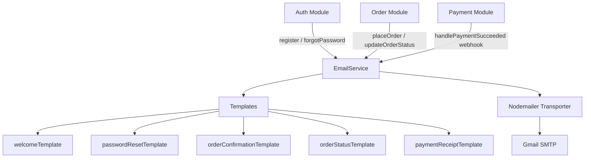

# Design Document: Email Notifications

## Overview

This design describes a centralized `EmailService` module for the ecommerce backend that sends transactional emails via Nodemailer with Gmail SMTP. The service integrates non-intrusively into the existing auth, order, and payment modules by being called fire-and-forget (errors are caught and logged, never propagated to the HTTP response). All email types are rendered from typed TypeScript template functions that produce HTML + plain-text pairs.

---

## Architecture



The `EmailService` is a singleton initialized once at application startup. Callers import it and call typed methods (`sendWelcomeEmail`, `sendPasswordResetEmail`, etc.). Each method builds the mail options from a template function and delegates to the internal `sendEmail` method.

---

## Components and Interfaces

### EmailService (`backend/src/services/email.service.ts`)

```typescript
interface SendEmailOptions {
  to: string;
  subject: string;
  html: string;
  text: string;
}

class EmailService {
  private transporter: nodemailer.Transporter;
  private enabled: boolean;

  constructor();                                          // reads env vars, creates transporter
  async verifyConnection(): Promise<void>;               // called at startup
  async sendEmail(options: SendEmailOptions): Promise<void>;

  async sendWelcomeEmail(to: string): Promise<void>;
  async sendPasswordResetEmail(to: string, resetToken: string): Promise<void>;
  async sendOrderConfirmationEmail(to: string, order: OrderEmailData): Promise<void>;
  async sendOrderStatusEmail(to: string, order: OrderStatusEmailData): Promise<void>;
  async sendPaymentReceiptEmail(to: string, payment: PaymentEmailData): Promise<void>;
}

export const emailService = new EmailService(); // singleton
```

### Data Transfer Types

```typescript
interface OrderEmailData {
  orderId: string;
  items: { name: string; quantity: number; price: number }[];
  totalAmount: number;
  shippingAddress: { line1: string; city: string; state: string; postalCode: string; country: string };
  createdAt: Date;
}

interface OrderStatusEmailData {
  orderId: string;
  status: 'processing' | 'shipped' | 'delivered' | 'cancelled';
  updatedAt: Date;
}

interface PaymentEmailData {
  orderId: string;
  amount: number;       // in cents (Stripe format)
  currency: string;
  paymentIntentId: string;
  paidAt: Date;
}
```

### Templates (`backend/src/services/email.templates.ts`)

Each template is a pure function `(data: T) => { html: string; text: string }`. Templates use simple string interpolation — no external templating engine dependency.

```typescript
export function welcomeTemplate(data: { email: string; frontendUrl: string }): EmailBody;
export function passwordResetTemplate(data: { resetUrl: string; frontendUrl: string }): EmailBody;
export function orderConfirmationTemplate(data: OrderEmailData & { frontendUrl: string }): EmailBody;
export function orderStatusTemplate(data: OrderStatusEmailData & { frontendUrl: string }): EmailBody;
export function paymentReceiptTemplate(data: PaymentEmailData & { frontendUrl: string }): EmailBody;

interface EmailBody { html: string; text: string; }
```

---

## Data Models

No new database models are required. The email service is stateless — it reads data passed by callers and sends emails. All data originates from existing models (`Order`, `User`, `Payment`).

### Environment Variables

| Variable | Description | Required |
|---|---|---|
| `EMAIL_USER` | Gmail address (sender) | Yes |
| `EMAIL_PASS` | Gmail app password (16-char) | Yes |
| `FRONTEND_URL` | Base URL for links in emails | Yes |
| `EMAIL_FROM_NAME` | Display name for sender (default: `"Ecommerce Store"`) | No |

---

## Correctness Properties

*A property is a characteristic or behavior that should hold true across all valid executions of a system — essentially, a formal statement about what the system should do. Properties serve as the bridge between human-readable specifications and machine-verifiable correctness guarantees.*

### Property 1: Templates never expose raw placeholder tokens

*For any* template function called with any combination of valid or partially-missing data, the rendered HTML and text output should never contain raw placeholder syntax (e.g., `{{field}}`, `undefined`, `[object Object]`).

**Validates: Requirements 2.2, 2.3**

---

### Property 2: Every rendered email contains platform name and footer

*For any* template function called with any valid data, the rendered HTML output should contain the platform name and a footer section with an unsubscribe notice.

**Validates: Requirements 2.5**

---

### Property 3: Every email send includes a plain-text fallback

*For any* call to `sendEmail`, the mail options object passed to the Nodemailer transporter should include a non-empty `text` property alongside the `html` property.

**Validates: Requirements 2.4**

---

### Property 4: Welcome email contains customer email and shop link

*For any* customer email address, the rendered welcome email HTML should contain that email address and a URL pointing to the frontend shop.

**Validates: Requirements 3.2, 3.3**

---

### Property 5: Password reset email contains full reset URL, expiry notice, and ignore notice

*For any* reset token and frontend base URL, the rendered password reset email HTML should contain a reset URL that includes both the base URL and the token, a mention of "1 hour" expiry, and an "ignore if you didn't request" notice.

**Validates: Requirements 4.2, 4.3, 4.5**

---

### Property 6: Order confirmation email contains all required order fields

*For any* order data (with any number of items, any total, any shipping address), the rendered order confirmation email HTML should contain the order ID, each item's name and quantity, the total amount, the shipping address, and a formatted date string.

**Validates: Requirements 5.2, 5.3**

---

### Property 7: Order status email contains required fields and status-specific content

*For any* order and any notifiable status (`processing`, `shipped`, `delivered`, `cancelled`), the rendered order status email HTML should contain the order ID and the status string. For `shipped` status it should additionally contain a delivery notice. For `cancelled` status it should additionally contain a support contact message.

**Validates: Requirements 6.2, 6.3, 6.4**

---

### Property 8: Payment receipt email contains all required payment fields

*For any* payment data (any order ID, amount, currency, payment intent ID, date), the rendered payment receipt email HTML should contain the order ID, a formatted amount, the currency, the payment intent ID, and a formatted date string.

**Validates: Requirements 7.2, 7.3**

---

## Error Handling

All public methods on `EmailService` follow the same error isolation pattern:

1. The internal `sendEmail` method logs errors and re-throws them.
2. Each typed method (`sendWelcomeEmail`, etc.) wraps `sendEmail` in a `try/catch`, logs the failure with context, and **does not re-throw** — so callers are never blocked.
3. If `EMAIL_USER` or `EMAIL_PASS` are missing at startup, `enabled` is set to `false` and all send methods return immediately after logging a warning.

```typescript
// Pattern used in every typed send method:
async sendWelcomeEmail(to: string): Promise<void> {
  try {
    const { html, text } = welcomeTemplate({ email: to, frontendUrl: this.frontendUrl });
    await this.sendEmail({ to, subject: 'Welcome to the store!', html, text });
  } catch (err) {
    logger.error('Failed to send welcome email', { to, error: err });
    // intentionally not re-thrown
  }
}
```

Integration points where email calls are added:

| Module | Location | Email Triggered |
|---|---|---|
| `auth.service.ts` | `register()` — after `User.create` | `sendWelcomeEmail` |
| `auth.service.ts` | `forgotPassword()` — after token stored | `sendPasswordResetEmail` |
| `order.service.ts` | `placeOrder()` — after order created | `sendOrderConfirmationEmail` |
| `order.service.ts` | `updateOrderStatus()` — after `order.save()` | `sendOrderStatusEmail` |
| `payment.service.ts` | `handlePaymentSucceeded()` — after order updated | `sendPaymentReceiptEmail` |

---

## Testing Strategy

### Dual Testing Approach

Both unit tests and property-based tests are used. Unit tests cover specific integration examples and error isolation. Property tests verify universal template correctness across all inputs.

### Property-Based Testing

The project uses `fast-check` (already installed). Each property test runs a minimum of 100 iterations.

Tag format: **Feature: email-notifications, Property N: property description**

Each correctness property above maps to exactly one property-based test in `backend/tests/properties/email.property.test.ts`.

**Property test generators needed:**
- Arbitrary email addresses: `fc.emailAddress()`
- Arbitrary reset tokens: `fc.hexaString({ minLength: 32, maxLength: 64 })`
- Arbitrary order data: `fc.record({ orderId: fc.hexaString({minLength:24,maxLength:24}), items: fc.array(fc.record({name: fc.string(), quantity: fc.integer({min:1}), price: fc.float({min:0.01})}), {minLength:1}), totalAmount: fc.float({min:0.01}), ... })`
- Arbitrary status values: `fc.constantFrom('processing', 'shipped', 'delivered', 'cancelled')`
- Arbitrary payment data: `fc.record({ orderId: ..., amount: fc.integer({min:1}), currency: fc.constantFrom('usd','eur'), ... })`

### Unit Tests

Unit tests live in `backend/tests/unit/email.service.test.ts` and cover:

- Singleton instance returns same object on multiple imports
- `sendEmail` re-throws transporter errors
- Each typed method catches errors and does not re-throw
- Service is disabled gracefully when env vars are missing
- `verifyConnection` failure does not crash the service
- Integration: `register()` calls `sendWelcomeEmail` with correct address
- Integration: `forgotPassword()` calls `sendPasswordResetEmail` with correct token
- Integration: `placeOrder()` calls `sendOrderConfirmationEmail`
- Integration: `updateOrderStatus()` calls `sendOrderStatusEmail` for notifiable statuses
- Integration: `handlePaymentSucceeded()` calls `sendPaymentReceiptEmail`
