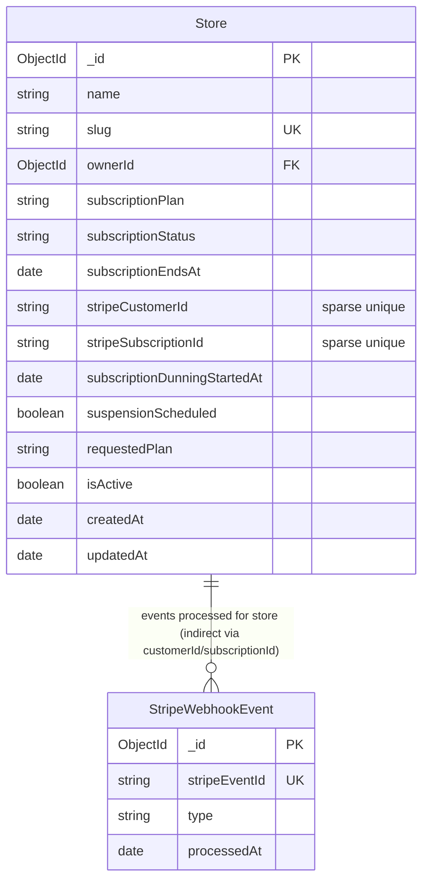

# Design Document — Stripe Subscription Billing

## Overview

This feature replaces Vendbase's manual plan-upgrade workflow with a fully automated,
webhook-driven subscription lifecycle. A dedicated `StripeWebhookEvent` collection
provides idempotency guarantees. A new `subscription.service.ts` handles all five
Stripe subscription/invoice event types. A cron-based dunning job evaluates grace-period
expiry every hour and promotes `past_due` stores to `suspended` when the 7-day window
has elapsed.

The design extends three existing files (`store.model.ts`, `payment.routes.ts`,
`planLimits.ts`, `config/index.ts`) and introduces two new ones
(`subscription.service.ts`, `stripeWebhookEvent.model.ts`). The existing
`payment.controller.ts` and its signature-verification path remain **unchanged** — the
subscription events are dispatched inside the extended `switch` block in
`payment.service.ts`.

---

## Architecture

```
┌────────────────────────────────────────────────────────────────────┐
│  Stripe Platform                                                   │
│  (subscription events, invoice events)                             │
└───────────────────────────┬────────────────────────────────────────┘
                            │ HTTPS POST  (raw body + Stripe-Signature)
                            ▼
┌────────────────────────────────────────────────────────────────────┐
│  payment.routes.ts                                                 │
│  POST /api/v1/payments/webhook                                     │
│  express.raw({ type: 'application/json' })  ← already in place    │
│  → stripeWebhook (payment.controller.ts)  ← unchanged             │
└───────────────────────────┬────────────────────────────────────────┘
                            │
                            ▼
┌────────────────────────────────────────────────────────────────────┐
│  payment.service.ts  handleWebhook()                               │
│  1. stripe.webhooks.constructEvent()  ← verify signature          │
│  2. StripeWebhookEvent.findOne()      ← idempotency guard          │
│  3. switch(event.type)                                             │
│     ├── payment_intent.*             → (existing handlers)        │
│     ├── customer.subscription.*      → subscription.service.ts    │
│     └── invoice.*                    → subscription.service.ts    │
│  4. StripeWebhookEvent.create()       ← record processed event    │
└───────────────────────────┬────────────────────────────────────────┘
                            │
                            ▼
┌────────────────────────────────────────────────────────────────────┐
│  subscription.service.ts                                           │
│  handleSubscriptionCreated()                                       │
│  handleSubscriptionUpdated()                                       │
│  handleSubscriptionDeleted()                                       │
│  handleInvoicePaymentSucceeded()                                   │
│  handleInvoicePaymentFailed()                                      │
│                                                                    │
│  lookupPlan(priceId) ← reads PriceMap from planLimits.ts          │
│  ensureStripeCustomer(storeId, email) ← Customer creation/reuse   │
└───────────────────────────┬────────────────────────────────────────┘
                            │
                 ┌──────────┴──────────┐
                 ▼                     ▼
       ┌─────────────────┐   ┌──────────────────────┐
       │  Store (MongoDB)│   │ StripeWebhookEvent   │
       │  store.model.ts │   │ (MongoDB)            │
       └─────────────────┘   └──────────────────────┘

┌────────────────────────────────────────────────────────────────────┐
│  Dunning Job  (server.ts — setInterval, 1 h)                       │
│  Queries: status=past_due AND dunningStartedAt < now - 7 days      │
│  Action:  $set { subscriptionStatus: 'suspended',                  │
│                   subscriptionDunningStartedAt: null }             │
└────────────────────────────────────────────────────────────────────┘
```

---

## Components and Interfaces

### 1. `stripeWebhookEvent.model.ts` (NEW)

```typescript
interface IStripeWebhookEvent {
  stripeEventId: string;   // unique index
  type: string;
  processedAt: Date;
}
```

Mongoose model `StripeWebhookEvent` with a unique index on `stripeEventId`.
Used exclusively for idempotency — duplicate event deliveries from Stripe are rejected
before any handler runs.

### 2. `store.model.ts` (EXTEND)

New fields added to `IStore` and the Mongoose schema:

```typescript
stripeCustomerId?:          string;  // sparse unique index  — cus_xxx
stripeSubscriptionId?:      string;  // sparse unique index  — sub_xxx
subscriptionDunningStartedAt?: Date; // set on first invoice.payment_failed
suspensionScheduled?:       boolean; // cleared on payment recovery
```

### 3. `planLimits.ts` (EXTEND)

Add a `PriceMap` type and a `lookupPlan` function sourced from environment variables:

```typescript
export type PriceMap = Record<string, SubscriptionPlan>;

// Built at module load time from env vars.
// lookupPlan returns undefined for any unknown priceId.
export function buildPriceMap(): PriceMap { ... }
export function lookupPlan(priceId: string): SubscriptionPlan | undefined { ... }
```

### 4. `config/index.ts` (EXTEND)

Three new optional keys added to the Zod schema (with startup warnings when absent):

```typescript
STRIPE_PRICE_STARTER:     z.string().optional(),
STRIPE_PRICE_PRO:         z.string().optional(),
STRIPE_PRICE_ENTERPRISE:  z.string().optional(),
```

### 5. `subscription.service.ts` (NEW)

Public API:

```typescript
// Called from payment.service.ts switch block
export async function handleSubscriptionCreated(event: Stripe.Event): Promise<void>
export async function handleSubscriptionUpdated(event: Stripe.Event): Promise<void>
export async function handleSubscriptionDeleted(event: Stripe.Event): Promise<void>
export async function handleInvoicePaymentSucceeded(event: Stripe.Event): Promise<void>
export async function handleInvoicePaymentFailed(event: Stripe.Event): Promise<void>

// Called from admin upgrade flow
export async function ensureStripeCustomer(storeId: string, email: string): Promise<string>

// Exported for dunning job and for testing
export async function runDunningJob(): Promise<void>
```

### 6. `payment.service.ts` (EXTEND)

The idempotency guard is migrated from `Payment.findOne({ stripeEventId })` to
`StripeWebhookEvent.findOne({ stripeEventId })`. The `switch` block gains five new
`case` arms that delegate to `subscription.service.ts`.

### 7. `payment.routes.ts` (EXTEND)

No route changes required — the `/webhook` route already uses `express.raw` and is
unauthenticated. The content-type check gains `application/octet-stream` to match
Requirement 3.1.

### 8. Dunning Job (`server.ts` or `subscription.service.ts`)

Registered at server startup via `setInterval(runDunningJob, 60 * 60 * 1000)`.
The job is a pure MongoDB bulk-update — no Stripe API calls.

---

## Data Models

### ER Diagram



> `StripeWebhookEvent` is keyed on Stripe's own event ID, not on a Store `_id`, so the
> relationship is indirect — each event payload carries either `customer` or
> `subscription` which resolves to a Store.

### TypeScript Interfaces

```typescript
// store.model.ts additions
export interface IStore extends Document {
  // ... existing fields ...
  stripeCustomerId?: string;
  stripeSubscriptionId?: string;
  subscriptionDunningStartedAt?: Date;
  suspensionScheduled?: boolean;
}

// stripeWebhookEvent.model.ts
export interface IStripeWebhookEvent extends Document {
  stripeEventId: string;
  type: string;
  processedAt: Date;
}

// planLimits.ts additions
export type PriceMap = Record<string, Exclude<SubscriptionPlan, 'free'>>;

export interface PriceMapConfig {
  STRIPE_PRICE_STARTER?:    string;
  STRIPE_PRICE_PRO?:        string;
  STRIPE_PRICE_ENTERPRISE?: string;
}
```

### MongoDB Index Summary

| Collection           | Index                                          | Type         |
|----------------------|------------------------------------------------|--------------|
| `stores`             | `stripeCustomerId`                             | sparse unique |
| `stores`             | `stripeSubscriptionId`                         | sparse unique |
| `stripewebhookevents`| `stripeEventId`                                | unique        |

These indexes are created in `create-indexes.ts` and also defined at the field level in
the Mongoose schemas as the canonical source of truth.

---

## Webhook Handler — Pseudo-code Flow

The following shows the complete pipeline for `POST /api/v1/payments/webhook`:

```
POST /api/v1/payments/webhook
  │
  ├─ express.raw({ type: 'application/json' })          [middleware]
  │    Reads raw Buffer — no JSON parsing
  │
  ├─ stripeWebhook()                                    [controller — UNCHANGED]
  │    Extract 'stripe-signature' header
  │    → call handleWebhook(rawBody, signature)
  │
  └─ handleWebhook(rawBody, signature)                  [payment.service.ts]
       │
       ├─ [STEP 1] Signature verification
       │    event = stripe.webhooks.constructEvent(rawBody, signature, STRIPE_WEBHOOK_SECRET)
       │    IF throws → respond 400, stop
       │    IF STRIPE_WEBHOOK_SECRET not set → respond 500, log CRITICAL, stop
       │
       ├─ [STEP 2] Structured logging — INFO
       │    log { eventId, type, customerId|subscriptionId }
       │
       ├─ [STEP 3] Idempotency check
       │    existing = await StripeWebhookEvent.findOne({ stripeEventId: event.id })
       │    IF existing → log INFO "duplicate ignored", respond 200, stop
       │
       ├─ [STEP 4] Event dispatch (try/catch wraps entire block)
       │    switch (event.type):
       │      'customer.subscription.created'  → handleSubscriptionCreated(event)
       │      'customer.subscription.updated'  → handleSubscriptionUpdated(event)
       │      'customer.subscription.deleted'  → handleSubscriptionDeleted(event)
       │      'invoice.payment_succeeded'      → handleInvoicePaymentSucceeded(event)
       │      'invoice.payment_failed'         → handleInvoicePaymentFailed(event)
       │      'payment_intent.succeeded'       → handlePaymentSucceeded(event)   [existing]
       │      'payment_intent.payment_failed'  → handlePaymentFailed(event)      [existing]
       │      default                          → log INFO "unhandled event type"
       │
       ├─ [STEP 5] Record processed event (only on success)
       │    await StripeWebhookEvent.create({
       │      stripeEventId: event.id,
       │      type: event.type,
       │      processedAt: new Date(),
       │    })
       │
       ├─ [STEP 6] Timeout safety
       │    IF elapsed > 25 s → log WARN, respond 200 early
       │
       └─ [STEP 7] catch (err)
            log ERROR { eventId, type, stack }
            respond 200   ← Stripe must not retry unprocessable events
```

**Key design decisions:**

- The idempotency insert (Step 5) happens *after* dispatch (Step 4) so that a handler
  crash does not silently suppress future retries. If Step 4 throws, the event ID is
  never recorded and Stripe will retry.
- The outer try/catch (Step 7) guarantees HTTP 200 for all cases except signature
  failure, meeting Requirement 11.
- The 25-second warning (Step 6) gives a 5-second buffer before Stripe's 30-second
  timeout cuts the connection.

---

## Event-to-State-Transition Mapping

| Stripe Event | Lookup Field | Store Field Mutations |
|---|---|---|
| `customer.subscription.created` (status: `active`/`trialing`) | `stripeCustomerId` | `subscriptionPlan` ← PriceMap(priceId)<br>`subscriptionStatus` ← `'active'`<br>`stripeSubscriptionId` ← sub_xxx<br>`subscriptionEndsAt` ← current_period_end |
| `customer.subscription.updated` (status: `active`) | `stripeSubscriptionId` | `subscriptionPlan` ← PriceMap(priceId)<br>`subscriptionStatus` ← `'active'`<br>`subscriptionEndsAt` ← new current_period_end |
| `customer.subscription.updated` (status: `past_due`) | `stripeSubscriptionId` | `subscriptionStatus` ← `'past_due'`<br>*(plan unchanged)* |
| `customer.subscription.updated` (status: `canceled`/`unpaid`) or `customer.subscription.deleted` | `stripeSubscriptionId` | `subscriptionStatus` ← `'cancelled'`<br>`subscriptionPlan` ← `'free'`<br>`subscriptionEndsAt` ← `null`<br>`stripeSubscriptionId` ← `null` (on deleted only) |
| `invoice.payment_succeeded` (billing_reason: `subscription_cycle`/`subscription_create`) | `stripeSubscriptionId` | `subscriptionStatus` ← `'active'`<br>`subscriptionEndsAt` ← lines.data[0].period.end<br>if was `past_due`: `subscriptionDunningStartedAt` ← `null`, `suspensionScheduled` ← `false` |
| `invoice.payment_failed` | `stripeSubscriptionId` | `subscriptionStatus` ← `'past_due'`<br>if `subscriptionDunningStartedAt` not set: `subscriptionDunningStartedAt` ← `now` |
| Dunning job (scheduled, not a Stripe event) | `subscriptionStatus === 'past_due'` AND `subscriptionDunningStartedAt < now - 7 days` | `subscriptionStatus` ← `'suspended'`<br>`subscriptionDunningStartedAt` ← `null` |

---

## Correctness Properties

*A property is a characteristic or behavior that should hold true across all valid
executions of a system — essentially, a formal statement about what the system should
do. Properties serve as the bridge between human-readable specifications and
machine-verifiable correctness guarantees.*

The project uses **fast-check** (already a dev dependency via existing property tests
in `tests/properties/`). Each property test runs a minimum of **100 iterations**.

---

### Property 1: Webhook Idempotency

*For any* valid Stripe event payload, processing that event N times (N ≥ 1) MUST
produce the same final `Store` state and exactly one `StripeWebhookEvent` document as
processing it exactly once.

**Validates: Requirements 4.1, 4.2, 4.3**

---

### Property 2: Subscription Created — Active/Trialing Produces Correct Store State

*For any* `customer.subscription.created` event with a `status` of `active` or
`trialing` and a Price ID that exists in the PriceMap, the resulting Store document
MUST have `subscriptionPlan` equal to the plan returned by `lookupPlan(priceId)`,
`subscriptionStatus` equal to `'active'`, `stripeSubscriptionId` equal to the
subscription ID from the event, and `subscriptionEndsAt` equal to the
`current_period_end` timestamp from the event converted to a JavaScript `Date`.

**Validates: Requirements 5.2**

---

### Property 3: Past-Due Status Does Not Change Plan

*For any* Store with any `subscriptionPlan` value, when a
`customer.subscription.updated` event with `status: 'past_due'` is processed, the
Store's `subscriptionPlan` field MUST remain unchanged.

**Validates: Requirements 6.3**

---

### Property 4: Cancellation Always Produces Free Plan

*For any* Store in any plan, when a `customer.subscription.updated` event with
`status: 'canceled'` or `'unpaid'`, or a `customer.subscription.deleted` event, is
processed, the Store MUST end up with `subscriptionPlan === 'free'` and
`subscriptionStatus === 'cancelled'`.

**Validates: Requirements 6.4, 7.2**

---

### Property 5: Invoice Payment Succeeded Clears Dunning State

*For any* Store that had `subscriptionStatus === 'past_due'` and a non-null
`subscriptionDunningStartedAt`, when an `invoice.payment_succeeded` event with
`billing_reason` of `subscription_cycle` or `subscription_create` is processed, the
Store MUST have `subscriptionDunningStartedAt === null` and
`suspensionScheduled === false` after the handler completes.

**Validates: Requirements 8.2, 8.3**

---

### Property 6: Dunning StartedAt Is Set Only Once (Idempotent on Repeated Failures)

*For any* Store, processing two or more `invoice.payment_failed` events in sequence
MUST result in `subscriptionDunningStartedAt` being set to the timestamp of the
**first** failure event. The second and subsequent failures MUST NOT overwrite the
original timestamp.

**Validates: Requirements 9.3**

---

### Property 7: Dunning Job Suspends Stores Past Grace Period

*For any* Store with `subscriptionStatus === 'past_due'` and
`subscriptionDunningStartedAt` set to a timestamp strictly older than 7 days, running
the dunning job MUST set `subscriptionStatus` to `'suspended'` and clear
`subscriptionDunningStartedAt` to `null`.

**Validates: Requirements 9.5**

---

### Property 8: Dunning Job Preserves Stores Within Grace Period

*For any* Store with `subscriptionStatus === 'past_due'` and
`subscriptionDunningStartedAt` set to a timestamp within the last 7 days (i.e., fewer
than 7 × 24 × 60 × 60 × 1000 ms ago), running the dunning job MUST NOT change the
Store's `subscriptionStatus` or `subscriptionPlan`.

**Validates: Requirements 9.4**

---

### Property 9: PriceMap Never Returns 'free'

*For any* Price ID that is registered in the PriceMap (i.e., mapped to a
`SubscriptionPlan`), `lookupPlan(priceId)` MUST return one of `'starter'`, `'pro'`, or
`'enterprise'` — never `'free'` and never `undefined`.

**Validates: Requirements 10.1, 10.2**

---

### Property 10: PriceMap Returns undefined for Unknown Price IDs

*For any* string that is not one of the three configured Price IDs
(`STRIPE_PRICE_STARTER`, `STRIPE_PRICE_PRO`, `STRIPE_PRICE_ENTERPRISE`),
`lookupPlan(unknownId)` MUST return `undefined` and MUST NOT fall back silently to any
plan value.

**Validates: Requirements 10.3**

---

### Property 11: HTTP 200 for All Post-Verification Events

*For any* event type (handled, unhandled, or one that triggers an internal exception),
if the Stripe signature verification passes, the webhook endpoint MUST respond with
HTTP 200.

**Validates: Requirements 11.1, 11.2**

---

### Property 12: Status-Change Events Produce Audit Log Entries

*For any* webhook event that causes a Store's `subscriptionStatus` to change, the
logger MUST emit an INFO-level entry containing the store's `_id`, the previous
`subscriptionStatus` value, and the new `subscriptionStatus` value.

**Validates: Requirements 12.2**

---

## Error Handling

### Signature Verification Failure (Req 3.4, 3.5)

- Missing or malformed `Stripe-Signature` → HTTP 400, no processing.
- `STRIPE_WEBHOOK_SECRET` not configured → HTTP 500, CRITICAL log with the missing key
  name. Server still starts (so other routes continue working), but the webhook handler
  is inoperative.

### Idempotency Collision (Req 4.3, 4.4)

- `StripeWebhookEvent.create()` may throw a duplicate-key error if two concurrent
  deliveries race past the `findOne` check. The outer try/catch catches this; the
  duplicate-key error code (`11000`) is recognized and treated as a non-error (log INFO,
  return HTTP 200).

### Missing Store (Req 5.4, 6.6, 7.3, 8.5, 9.6)

- All five handlers log a WARN including the searched identifier and return normally
  (not throw). The outer handler then inserts the `StripeWebhookEvent` record and
  responds HTTP 200.

### Unknown Price ID (Req 5.3, 6.5, 10.3)

- `lookupPlan()` returns `undefined`. The handler logs a WARN with the event ID and
  unrecognised Price ID and returns without modifying the Store.

### Stripe Customer Creation Failure (Req 2.3, 2.4)

- Stripe API error → throw, return 500 to caller, no partial state written.
- Stripe success + DB write failure → log ERROR with orphaned `cus_xxx` value, return
  500 to caller. Manual recovery via the logged ID is possible.

### Database Update Failure During `invoice.payment_succeeded` (Req 8.6)

- `await Store.findOneAndUpdate(...)` throws → re-throw from the handler. The outer
  try/catch logs ERROR and responds HTTP 500, causing Stripe to retry delivery.
  This is the one case where a non-200 response is intentional.

### Dunning Job Errors

- Any exception during `runDunningJob()` is caught, logged at ERROR level with a
  timestamp, and does not crash the server process. The next hourly run will attempt
  the same stores again.

### Timeout Guard (Req 11.5)

```typescript
const deadline = Date.now() + 25_000;
// ... processing ...
if (Date.now() > deadline) {
  logger.warn('Webhook processing exceeded 25 s', { eventId: event.id, elapsed });
  res.status(200).json({ received: true });
  return;
}
```

---

## Testing Strategy

### Unit Tests (example-based)

Located in `backend/tests/unit/payments/`:

- `ensureStripeCustomer` — idempotency (existing `stripeCustomerId` prevents API call)
- `ensureStripeCustomer` — Stripe API failure propagates correctly
- `handleInvoicePaymentSucceeded` — `billing_reason` other than cycle/create is a no-op
- Signature failure → HTTP 400
- Missing webhook secret → HTTP 500

### Property-Based Tests (fast-check)

Located in `backend/tests/properties/subscription.property.test.ts`.

Each property test maps directly to a numbered Correctness Property above.
Tag format in test files:
`// Feature: stripe-subscription-billing, Property N: <property_text>`

Configuration:

```typescript
fc.assert(fc.asyncProperty(...), { numRuns: 100 });
```

| Test | Property | Key Generator |
|------|----------|---------------|
| Idempotency | Property 1 | `fc.record({ eventId: fc.uuid(), eventType: fc.constantFrom(...), ... })` |
| Subscription created state | Property 2 | `fc.record({ priceId: fc.constantFrom(knownPriceIds), periodEnd: fc.integer() })` |
| Past-due preserves plan | Property 3 | `fc.constantFrom('starter', 'pro', 'enterprise')` for initial plan |
| Cancellation → free | Property 4 | `fc.constantFrom('canceled', 'unpaid')` for event status |
| Payment success clears dunning | Property 5 | `fc.date()` for `subscriptionDunningStartedAt` |
| Dunning startedAt is idempotent | Property 6 | `fc.nat({ max: 5 })` for repeat count |
| Dunning job suspends old stores | Property 7 | `fc.integer({ min: 7*24*60*60*1000 })` for age offset |
| Dunning job preserves new stores | Property 8 | `fc.integer({ max: 7*24*60*60*1000 - 1 })` for age offset |
| PriceMap never returns free | Property 9 | `fc.constantFrom(...knownPriceIds)` |
| PriceMap undefined for unknowns | Property 10 | `fc.string().filter(s => !knownPriceIds.includes(s))` |
| HTTP 200 always | Property 11 | `fc.constantFrom(...allEventTypes, 'unknown.event')` |
| Audit log on status change | Property 12 | `fc.constantFrom(...validStatusTransitions)` |

### Integration Tests

Located in `backend/tests/integration/payments/`:

- End-to-end webhook delivery with a real Stripe test clock (or Stripe CLI webhook
  forwarding in CI)
- Duplicate-key race condition on `StripeWebhookEvent` (spawn two concurrent requests
  with the same event ID)
- Dunning job + `runDunningJob()` against a real MongoDB test database

### Smoke Tests

- `STRIPE_PRICE_*` env vars absent at startup → warning emitted, server starts
- Unique indexes present on `stores.stripeCustomerId`, `stores.stripeSubscriptionId`,
  `stripewebhookevents.stripeEventId`
